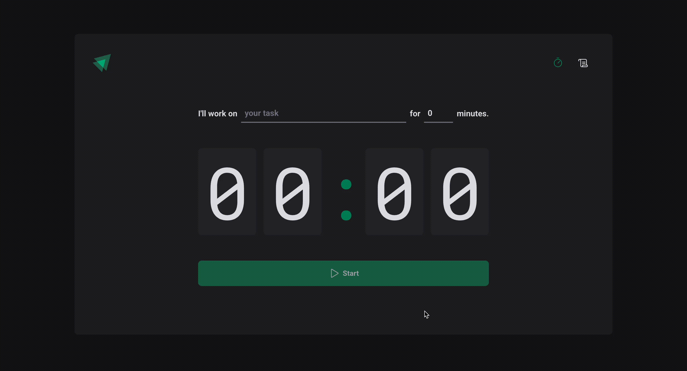

# 🇬🇧 English

## Pomodoro Timer

This project was created to practice React concepts. It features a functional Pomodoro timer with a clean and interactive interface, serving as a hands-on exercise in modern React development.

### Technologies used

- **Vite**: Used as the build tool and development server.
- **styled-components**: Utilized for writing CSS-in-JS.
- **React**: The main JavaScript library used to build the user interface and manage component state.
- **Context API**: Employed to manage and share global state across components without prop drilling.
- **useReducer**: Used for handling complex state logic and state transitions in a predictable way within the timer functionality.

### Features

- Fully functional Pomodoro timer with options to start and interrupt sessions.
- History of previous cycles, displaying each cycle and its current status.

### How to run the project

1. Clone this repository to your computer with the command:
   ```
   git clone https://github.com/juliadesouza/pomodoro-timer.git
   ```
2. Navigate to the project directory:
   ```
   cd pomodoro-timer
   ```
3. Install the dependencies:

   ```
   npm install
   ```

4. Run the project:

   ```
   cd pomodoro-timer
   ```

---

# 🇧🇷 Português

## Pomodoro Timer

Este projeto foi criado para praticar conceitos do React. Ele apresenta um timer Pomodoro funcional com uma interface limpa e interativa, servindo como um exercício prático de desenvolvimento moderno com React.

### Tecnologias utilizadas

- **Vite**: Utilizado como ferramenta de build e servidor de desenvolvimento.
- **styled-components**: Utilizado para escrever CSS-in-JS.
- **React**: Principal biblioteca JavaScript usada para construir a interface do usuário e gerenciar o estado dos componentes.
- **Context API**: Empregada para gerenciar e compartilhar o estado global entre os componentes sem a necessidade de prop drilling.
- **useReducer**: Usado para lidar com lógica de estado complexa e transições de estado de forma previsível dentro da funcionalidade do timer.

### Funcionalidades

- Timer Pomodoro totalmente funcional com opções para iniciar e interromper sessões.
- Histórico dos ciclos anteriores, exibindo cada ciclo e seu status atual.

### Como rodar o projeto

1. Clone este repositório para o seu computador com o comando:
   ```
   git clone https://github.com/juliadesouza/pomodoro-timer.git
   ```
2. Navegue até o diretório do projeto:
   ```
   cd pomodoro-timer
   ```
3. Instale as dependências:
   ```
   npm install
   ```
4. Rode o projeto:
   ```
   cd pomodoro-timer
   ```

---
